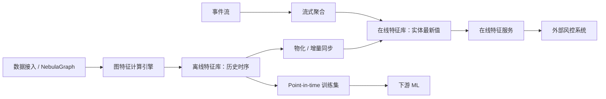

# 企业级图特征工厂设计与实施方案

## 1. 建设目标与边界

目标是为金融机构提供可治理、可解释、可复现、可低延迟调用的图规则和图特征平台。平台同时服务三类消费者：实时风控决策、离线策略分析、机器学习训练与推理。

首期不建设通用低代码计算平台，也不允许任意脚本进入在线链路。可视化画布只编排平台白名单算子；全图算法和嵌入进入异步作业；在线服务只读取已物化特征或执行经过发布审批的有界规则。

## 2. 产品信息架构

1. **规则与特征编排**：拖入输入、过滤、图遍历、模式、聚合、判断和输出算子，连线形成 DAG；支持样本预览、校验、证据子图和发布审批。
2. **特征目录**：统一管理规则特征、结构特征、时序聚合、社区特征和向量特征，展示负责人、实体、口径、版本、血缘、SLA 和消费者。
3. **计算与物化**：管理批处理、流处理、增量物化、回填、重算、资源配额和失败重试。
4. **在线服务**：管理 Feature Service、实体键、TTL、鉴权、限流、SDK 和调用指标。
5. **监控治理**：时效/缺失/一致性/漂移监控，审批、审计、影响分析和下线策略。
6. **ML 集成**：生成 point-in-time 正确训练集，导出数据集/向量，登记模型依赖并校验训练服务偏差。

## 3. 可视化规则与指标编排

### 3.1 算子体系

| 类别 | 首期算子 | 关键配置 |
|---|---|---|
| 输入 | 实体、事件、图快照、实体集合 | 图实例、标签、实体键、事件时间 |
| 过滤 | 属性比较、集合、空值、时间窗 | 字段、操作符、参数、窗口 |
| 图遍历 | 邻居展开、路径、最短路径 | 方向、边类型、1-N 跳、去重、上限 |
| 模式 | 共设备、资金回流、担保环、星型扩散 | 点边约束、时间/金额约束、路径语义 |
| 聚合 | count、distinct、sum、avg、max、ratio | 分组键、窗口、空值策略 |
| 逻辑 | AND、OR、NOT、CASE、阈值 | 分支、优先级、缺失值语义 |
| 算法 | 度、PageRank、社区、k-core、Node2Vec、GraphSAGE | 快照、参数、资源、刷新周期 |
| 输出 | 布尔规则、数值、向量、风险分、证据子图 | 类型、TTL、敏感级别、服务级别 |

编辑器使用带类型端口的 DAG。拖拽创建节点，连线创建依赖，右侧编辑所选算子。发布前执行：Schema/端口类型校验、环检测、跳数与基数估算、敏感字段权限检查、样本执行和成本门禁。

### 3.2 受控中间表示

画布保存为不可执行的定义，后端转换为版本化 IR：

```json
{
  "featureId": "fund_return_30d",
  "entity": "company",
  "graphInstanceId": "anti_fraud_kg",
  "eventTimeField": "apply_time",
  "nodes": [
    {"id":"input","op":"ENTITY_INPUT","config":{"label":"company"}},
    {"id":"path","op":"PATH_MATCH","config":{"edgeTypes":["transfer"],"minHop":2,"maxHop":4,"simplePath":true,"limit":200}},
    {"id":"window","op":"TIME_FILTER","config":{"duration":"30d"}},
    {"id":"agg","op":"COUNT_DISTINCT","config":{"field":"path.end.vid"}},
    {"id":"output","op":"FEATURE_OUTPUT","config":{"type":"INT64","evidence":true}}
  ],
  "edges":[["input","path"],["path","window"],["window","agg"],["agg","output"]]
}
```

编译器把 IR 转换为参数化 nGQL、受控 Procedure 或批/流作业规范。发布产物包括 IR、编译结果摘要、输入 Schema 版本、算法/镜像版本、测试证据和内容哈希。禁止循环、无界路径、任意代码和动态 DDL。

### 3.3 可解释返回

规则服务统一返回 `value/status/featureVersion/eventTime/freshness/evidenceGraph/operatorTrace/traceId`。证据图对节点、边和敏感属性按调用方权限脱敏，并设置节点数、路径数和响应体上限。

## 4. 算法与嵌入分层

- **实时可计算**：有界邻域计数、1-3 跳模式、已建立索引的属性过滤；必须经过成本估算、超时和熔断。
- **离线结构特征**：入/出/加权度、PageRank、k-core、三角形/聚类系数、连通分量、Louvain/Leiden/标签传播社区。每次结果绑定图快照、水位和算法参数。
- **Node2Vec**：稳定图上批量训练和物化，适合下游分类/链接预测。图变化达到阈值或定期重训；版本需固定随机种子、维度、walk 参数和训练数据快照。
- **GraphSAGE**：需要节点输入特征、采样器、训练/验证集和模型注册。首期采用批量预计算；只有确有新节点毫秒级需求后才建设在线推理，避免把邻域采样直接压到核心风控链路。

算法正确性以小型黄金图验证精确结果，以中大型基准图验证近似容差、确定性和资源曲线。社区 ID 不能被当作跨版本稳定业务编码。

## 5. 在线、离线与时点一致性



所有特征值使用统一主键：`tenant_id + graph_instance_id + entity_type + entity_key + feature_id + feature_version + event_time`。另保存 `computed_at/source_watermark/graph_snapshot_id/status`。离线库保留历史，在线库只保存服务版本的最新有效值并遵守 TTL。

训练集必须按样本事件时间做 point-in-time join，禁止使用事件之后产生的值。物化任务持续校验在线/离线抽样一致性、延迟和缺失率。

## 6. 版本、血缘与发布治理

领域对象包括 `FeatureDefinition`、`FeatureVersion`、`FeatureSet`、`FeatureService`、`ComputeJob`、`Materialization`、`DataQualityRule`、`ConsumerBinding`。

生命周期为：草稿 → 已验证 → 待审批 → 已发布 → 已废弃 → 已归档。发布版本不可修改；任何口径、参数、依赖、数据类型或算法变化产生新版本。版本记录依赖 Schema/数据源/图快照/上游特征/算法镜像，支持影响分析和并行灰度。

权限至少区分查看、编辑、验证、审批、发布、调用和查看敏感证据。生产发布采用双人审批、审计日志、服务白名单和回滚到上一稳定版本。

## 7. 对外服务契约

### 在线读取

`POST /api/v1/feature-services/{service}/online-features`

```json
{
  "entities":[{"entityType":"company","entityKey":"C001"}],
  "featureRefs":["risk.degree_30d@2","risk.pagerank@4"],
  "requestTime":"2026-08-13T10:00:00+08:00",
  "includeEvidence":false
}
```

### 规则评估

`POST /api/v1/rules/{ruleId}/evaluate`，只调用已发布版本；支持幂等键、超时预算和可选证据。

### 离线训练集

`POST /api/v1/training-datasets` 提交异步 point-in-time 取数，返回任务 ID 和受权限控制的产物地址。

对外采用 OIDC/OAuth2 client credentials 或 mTLS、租户 RBAC、实体/特征级授权、速率限制、请求大小限制、审计和脱敏。提供 Java/Python SDK，Kafka 输出和批量文件导出作为补充，不让外部系统直接访问 Redis/NebulaGraph。

建议试点 SLO：在线已物化特征 P95 < 50ms、P99 < 100ms，可用性 99.95%；同步规则 P95 < 200ms，超时即降级为明确的 unavailable，不把缺失误解释为 0。最终阈值需基于机构网络和压测确认。

## 8. 监控与漂移

- 服务：QPS、延迟直方图、P95/P99、错误/超时、限流、缓存命中、在线库可用性。
- 数据质量：覆盖率、空值、非法值、唯一性、刷新时效、在线/离线偏差、训练服务偏差。
- 分布漂移：数值使用 PSI/KS/Wasserstein 等，类别使用 PSI/JS；阈值按特征和业务窗口配置。
- 图结构漂移：节点/边数、度分布、边类型占比、连通分量、社区规模与成员变动。
- 向量漂移：范数、质心、余弦距离分布、近邻稳定度。
- 治理：负责人、基线窗口、告警等级、静默期、工单和审计。漂移只触发告警/审批，不默认自动下线。

## 9. 推荐技术架构与选型原则

- NebulaGraph：业务图、在线有界探索和证据查询。
- 图计算层：先对 Nebula 导出/快照执行批算法；规模验证后在 Spark/Flink/GPU 图引擎间按算法与数据量选型。
- PostgreSQL：定义、版本、审批、血缘、任务、服务和审计元数据。
- 湖仓（Parquet/Iceberg 等）：历史特征、训练集和回填结果。
- Redis/Cassandra 类在线库：按容量、延迟、HA 和机构基础设施 PoC 选型。
- 对象存储：模型、嵌入分片、快照和质量报告。
- Prometheus/Grafana：服务与数据质量指标；延迟使用可聚合直方图。
- Feast：建议做 2 周 PoC，验证 point-in-time join、物化、Java 客户端、RBAC 和现有湖仓适配。平台仍需自研图规则编译、证据图和图算法调度。

## 10. 分期实施计划（单机构生产试点）

| 阶段 | 周期 | 主要交付 | 验收门禁 |
|---|---:|---|---|
| 0. 基线与 PoC | 2 周 | 领域模型、IR、Feast/存储 PoC、SLO 容量模型 | 关键技术决策 ADR、两条端到端样例 |
| 1. 规则与目录 MVP | 4 周 | 可视化 DAG、受控编译、规则/特征目录、版本审批、证据图 | 资金回流/共设备/担保环黄金用例；无界查询拦截 |
| 2. 离线特征计算 | 4 周 | 度/PageRank/社区、快照、调度、回填、历史库 | 黄金图正确性、千万级基准、失败可重跑 |
| 3. 在线服务 | 4 周 | 物化、在线库、Feature Service、Java/Python SDK、鉴权限流 | SLO 压测、HA/降级、在线离线一致性 |
| 4. 嵌入与 ML | 4 周 | Node2Vec、GraphSAGE 批推理、训练集、模型/数据血缘 | 无泄漏时点测试、可复现训练、向量质量基线 |
| 5. 监控与生产加固 | 3 周 | 漂移、告警、审计、灰度/回滚、运维手册 | 安全、灾备、容量、演练与 UAT 全通过 |

建议核心团队 9-11 人：产品/金融策略 1、架构 1、前端 1.5、平台后端 2、图算法 2、数据工程 1.5、测试 1、SRE/安全共享 1。总周期约 21 周，可让阶段 2 与在线基础设施部分并行，但不可跳过阶段 0 的契约和容量验证。

## 11. 测试计划

1. **编排与编译**：端口类型、环路、参数边界、IR golden、GQL/作业编译 golden、恶意输入、复杂度门禁。
2. **规则正确性**：金融黄金图验证命中/不命中/边界，证据路径与结果一致，缺失值语义固定。
3. **算法正确性**：小图精确值、近似算法容差、随机种子可复现、社区/嵌入版本语义。
4. **时间正确性**：未来数据泄漏、迟到数据、TTL、时区、事件时间/处理时间、历史回放。
5. **一致性**：在线与离线抽样、回填与增量、双版本灰度、缓存失效。
6. **性能容量**：热点实体、批量请求、并发、超大邻域、图规模阶梯、向量维度、回填窗口。
7. **韧性**：Nebula/在线库/调度器故障、部分超时、重试幂等、熔断降级、跨 AZ 恢复。
8. **安全合规**：租户越权、特征级授权、证据脱敏、凭据轮换、审计不可抵赖、依赖和镜像扫描。
9. **漂移验证**：合成均值/类别/拓扑/向量漂移，校验检出率、误报和告警路由。
10. **端到端 UAT**：策略人员发布规则 → 批计算 → 物化 → 外部系统调用 → 监控 → 新版本灰度/回滚。

发布门禁要求 P0/P1 缺陷为零、关键路径自动化通过、性能达到容量模型、无高危安全问题、灾备演练完成，并有负责人签署的特征口径与降级策略。

## 12. 首批业务样例

- 30 日资金回流：申请企业出发 2-4 跳转账路径回到关联方，输出命中、回流金额、路径数和证据路径。
- 共设备团伙：申请人 7 日内共享手机号/设备/IP 的一跳与二跳人数，输出 distinct 计数和星型子图。
- 担保环：企业间 2-5 跳闭环担保，输出最小环长、环数量和涉险敞口。
- 垒大户：账户分层聚合后出现集中入账与快速分散，组合时间窗、金额阈值、路径和社区特征。

这四条样例覆盖模式、路径、聚合、时间窗、离线算法、在线服务和解释性，可作为阶段 0-3 的连续验收主线。
